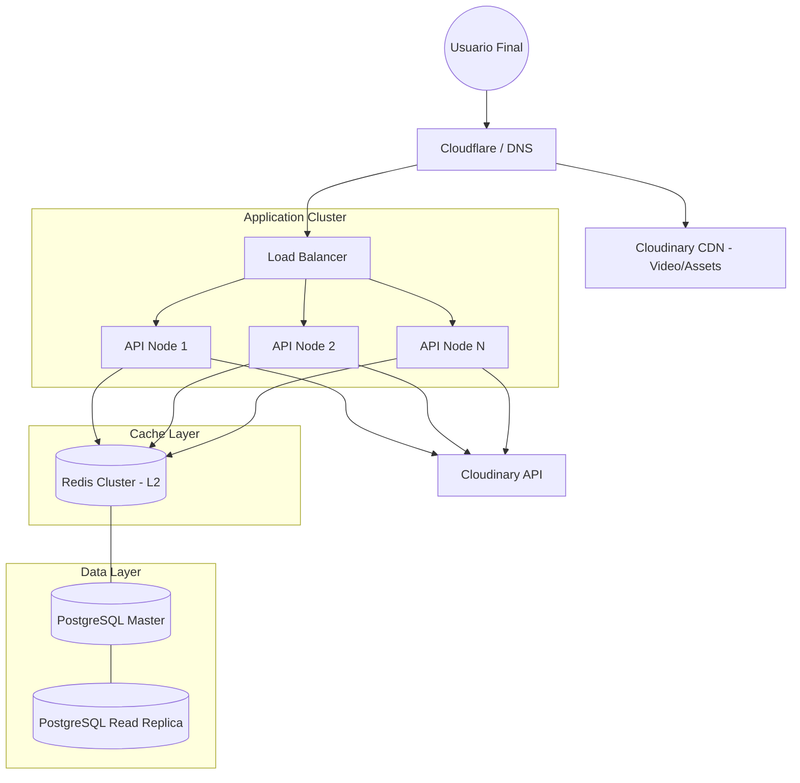
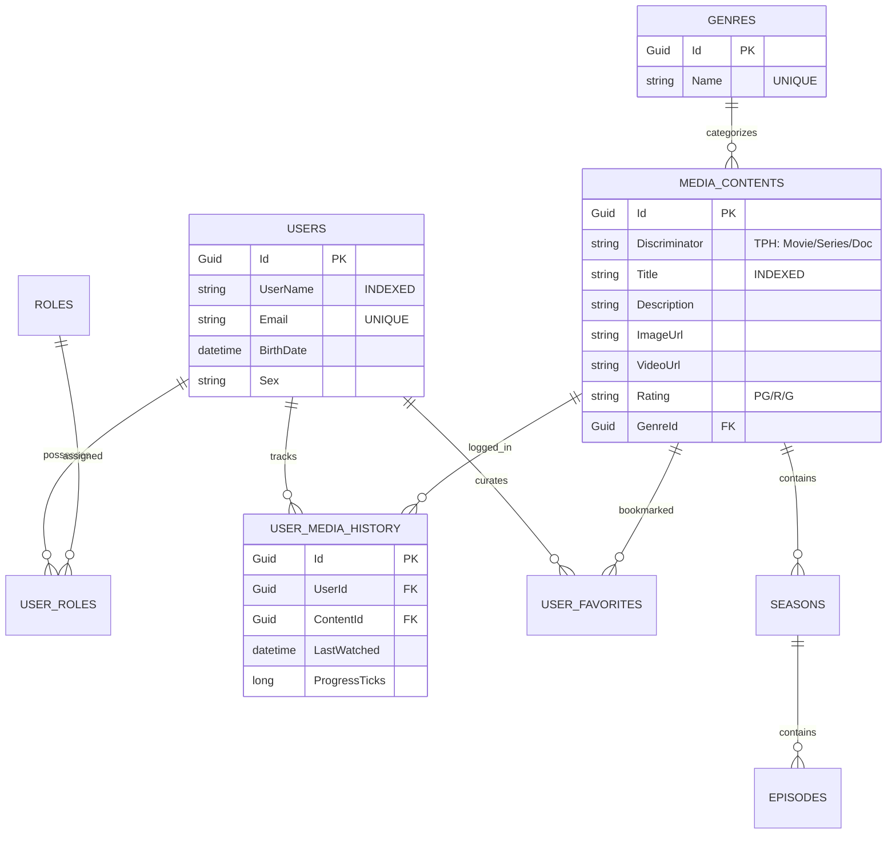
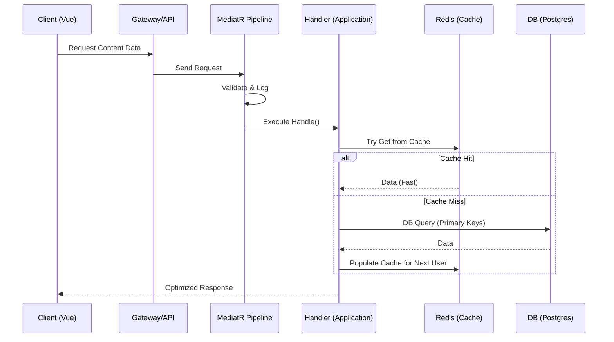
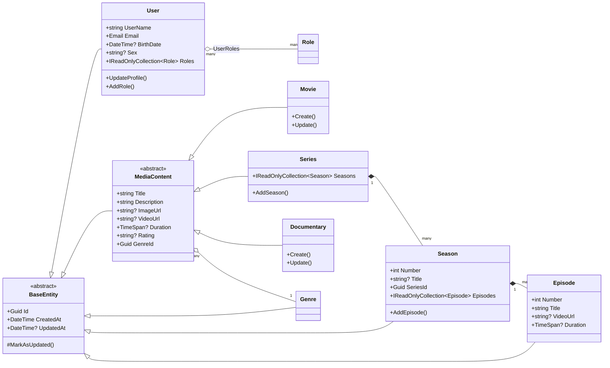

# 🎥 StarterLogin: Enterprise Media Streaming Platform

[](https://dotnet.microsoft.com/)
[](https://vuejs.org/)
[](https://www.postgresql.org/)
[](#)

Una plataforma de streaming multimedia de alto rendimiento construida para la **escalabilidad masiva** y la **estabilidad empresarial**. Diseñada bajo los principios de **Clean Architecture**, **DDD** (Domain-Driven Design) y **CQRS**, esta solución ofrece una base sólida para gestionar millones de usuarios y peticiones concurrentes.

---

## 🏗️ Stack Tecnológico de Alto Rendimiento

| Capa | Tecnologías | Propósito |
| :--- | :--- | :--- |
| **Edge / CDN** | Cloudinary CDN | Entrega de contenido multimedia de baja latencia a nivel global. |
| **API Layer** | .NET 9.0 Web API | Core de alto rendimiento con procesamiento asíncrono nativo. |
| **Data Orchestration** | MediatR (CQRS) | Desacoplamiento total de comandos y consultas para escalado independiente. |
| **Persistence** | PostgreSQL | Almacenamiento relacional robusto con soporte para particionamiento. |
| **Caching Tier** | Redis (L2) & MemoryCache (L1) | Estrategia de caché distribuida para reducir la carga en la DB. |
| **Frontend** | Vue 3 + Vite + Pinia | Interfaz reactiva optimizada para una experiencia de usuario fluida. |

---

## 📊 Arquitectura de Grado Superior

### 🌐 Infraestructura para Millones de Usuarios
Este diagrama describe cómo el sistema escala horizontalmente mediante el uso de capas de caché y distribución de carga.



### 🧬 Modelo de Datos Refinado (ER)
Estructura optimizada para consultas masivas, utilizando **TPH (Table Per Hierarchy)** para contenido y relaciones densas para historial y favoritos.



### ⚡ Ciclo de Vida de una Petición (Escalabilidad)
Cómo MediatR y el Pipeline se encargan de la validación y el logging antes de tocar el Dominio.



### Clase de Dominio e Herencia (DDD)
Diagrama detallado de la jerarquía de objetos de dominio. Se han incluido todas las propiedades para evitar cajas vacías y asegurar la comprensión total del modelo.



---

## 🚀 Estrategia para Millones de Usuarios

Para soportar una carga de **millones de usuarios activos**, la arquitectura implementa y recomienda los siguientes patrones:

1.  **Read Replicas (PostgreSQL)**: Separación de tráfico de lectura (90%) y escritura (10%). Las consultas de catálogo se dirigen a nodos de solo lectura.
2.  **Multilevel Caching**: 
    - **L1 (MemoryCache)**: Local en el nodo API para objetos estáticos (Géneros, Configuración).
    - **L2 (Redis)**: Caché distribuido para sesiones de usuario y metadatos de contenido popular.
3.  **Database Indexing & Partitioning**: 
    - Índices B-Tree en columnas de búsqueda frecuente (`Title`, `Email`).
    - Sugerencia de Particionamiento por `CreatedAt` para la tabla `USER_MEDIA_HISTORY` para mantener el rendimiento a pesar de miles de millones de registros.
4.  **Async Everything**: Uso intensivo de `Task/await` en .NET para no bloquear hilos del pool, permitiendo miles de peticiones simultáneas por nodo.
5.  **CDN-First Delivery**: El tráfico pesado de video no toca nuestros servidores; Cloudinary CDN entrega el contenido desde el nodo más cercano al usuario.

---

## 📽️ Nuevas Funcionalidades Multimedia
- **Tipos de Contenido**: Soporte para Películas, Series y Documentales con herencia optimizada (TPH).
- **Categorización**: Sistema de géneros dinámicos.
- **Experiencia de Usuario**: Historial de reproducción (continuar viendo) y lista de favoritos.
- **Búsqueda Proactiva**: Búsqueda por título y género con recomendaciones inteligentes.
- **Seguridad**: Validación de edad automática para contenido restringido.

---

## 🗺️ Mapa del Proyecto

### 🟡 Resumen Técnico (Docker)
| Servicio | URL Local | Puerto Host | Notas |
| :--- | :--- | :--- | :--- |
| **Frontend** | `http://localhost:5900` | 5900 | Interfaz de usuario (Vue 3) |
| **Backend API** | `http://localhost:5901` | 5901 | Endpoint base: `/api` |
| **API Docs (Swagger)** | `http://localhost:5901/swagger` | 5901 | Documentación Interactiva |
| **Base de Datos** | `localhost:5902` | 5902 | PostgreSQL (admin/admin) |

---

### 🟢 Backend (Ver [Guía Detallada](./LogiBackend/README.md))

| Capa | Responsabilidad |
| :--- | :--- |
| **StarterLogin.Domain** | Entidades de negocio y lógica pura. |
| **StarterLogin.Application** | Orquestación y casos de uso (MediatR). |
| **StarterLogin.Infrastructure** | Datos (EF Core), Seguridad y JWT. |
| **StarterLogin.Api** | Controladores y Endpoints REST. |

### 🔵 Frontend (Ver [Guía Detallada](./LogiFrontend/README.md))

| Directorio | Responsabilidad |
| :--- | :--- |
| **`api/`** | Servicios de comunicación HTTP (Axios) configurados para interactuar con el backend. |
| **`stores/`** | Gestión del estado global (Autenticación, Notificaciones) mediante Pinia. |
| **`views/`** | Páginas principales de la aplicación (Login, Dashboard, Perfil). |
| **`components/`** | Elementos de UI reutilizables como la barra de navegación y contenedores de mensajes. |

---

## 🔄 Ciclo de Vida de una Petición (Ejemplo: Login)

Para entender cómo fluye la información a través del sistema, aquí se detalla el ciclo de vida de una solicitud de inicio de sesión:

1.  **Frontend (UI)**: El usuario introduce sus credenciales en `Login.vue`. Al hacer clic en "Entrar", se invoca la acción `login` en el `authStore`.
2.  **Frontend (API)**: El `authStore` envía una petición POST a `/api/auth/login` mediante Axios.
3.  **Backend (API)**: El `AuthController` recibe la solicitud y delega la ejecución al `Mediator` enviando un `LoginUserQuery`.
4.  **Backend (Application)**: El `LoginUserQueryHandler` toma el control.
    - Consulta al repositorio (`Infrastructure`) para encontrar al usuario en PostgreSQL.
    - Valida la contraseña usando el servicio de hashing.
    - Si es válido, solicita al generador de tokens un JWT firmado.
5.  **Backend (Infrastructure)**: El repositorio realiza la consulta SQL optimizada a la base de datos PostgreSQL.
6.  **Respuesta**: El `Handler` devuelve la información del usuario y el token al controlador, que responde con un `200 OK`.
7.  **Sincronización**: El Store de Vue guarda el token y redirige al usuario al **Dashboard**.

---

## 🛠️ Configuración y Ejecución

### Requisitos
- .NET 9.0 SDK
- PostgreSQL
- Node.js (v18+)

### Ejecución con Docker (Recomendado)
```bash
docker-compose up --build
```

### Ejecución Manual
1.  **Base de Datos**: Asegúrate de tener PostgreSQL corriendo (en el puerto **5902** si usas Docker) y actualiza el `appsettings.json`.
2.  **Migraciones**: Al cambiar de SQL Server a PostgreSQL, es necesario regenerar las migraciones:
    ```bash
    cd LogiBackend/src/StarterLogin.Infrastructure
    dotnet ef migrations add InitialPostgres --startup-project ../StarterLogin.Api
    dotnet ef database update --startup-project ../StarterLogin.Api
    ```
3.  **Backend**:
    ```bash
    cd LogiBackend/src/StarterLogin.Api
    dotnet run
    ```
4.  **Frontend**:
    ```bash
    cd LogiFrontend
    npm install
    npm run dev
    ```

---

## 🛠️ Comandos Útiles (Useful Commands)

### 🐳 Docker & Despliegue
- `docker-compose up --build`: Construye y levanta todo el sistema.
- `docker-compose down -v`: Borra todo y **limpia la base de datos**. Útil para resetear seeds.
- `docker logs -f starterlogin-backend-1`: Ver logs del servidor en tiempo real.

### 🛡️ Backend (.NET)
- `dotnet watch --project LogiBackend/src/StarterLogin.Api`: Inicia con auto-recarga.
- `dotnet ef migrations add <Nombre> --project LogiBackend/src/StarterLogin.Infrastructure --startup-project LogiBackend/src/StarterLogin.Api`: Crea una migración.
- `dotnet ef database update --project LogiBackend/src/StarterLogin.Infrastructure --startup-project LogiBackend/src/StarterLogin.Api`: Aplica cambios a la DB.

### 🎨 Frontend (Vue)
- `npm run dev`: Servidor de desarrollo rápido con HMR.
- `npm run build`: Genera archivos optimizados para producción.

---

## 💡 Consejos Pro

- **Limpieza de Caché**: Si Docker se comporta extraño, usa `docker system prune` (Cuidado: borra todo lo que no uses).
- **Puertos**: Si cambias los puertos en `docker-compose.yml`, recuerda actualizar el `baseURL` en `LogiFrontend/src/api/axios.ts`.
- **Transparencia**: Usa la interfaz de **Swagger** (`/swagger`) para probar los endpoints sin necesidad de usar el frontend.

---

## 📄 Licencia
Este proyecto está bajo la licencia MIT.
