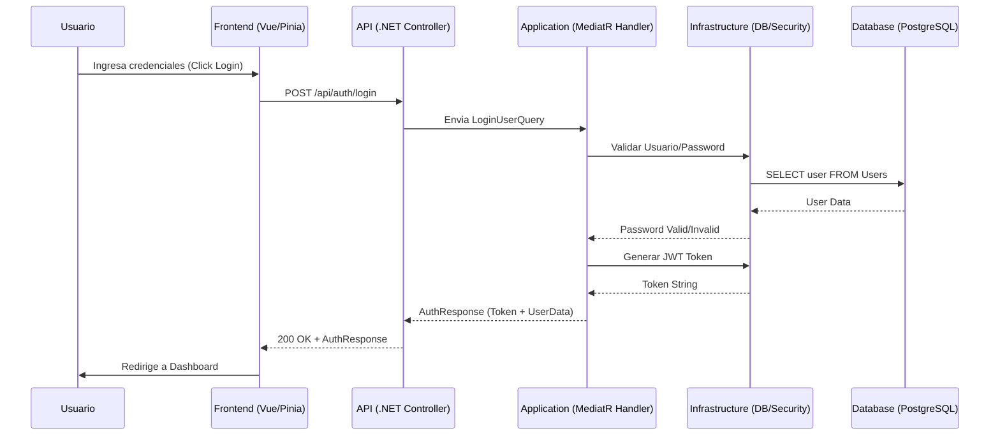
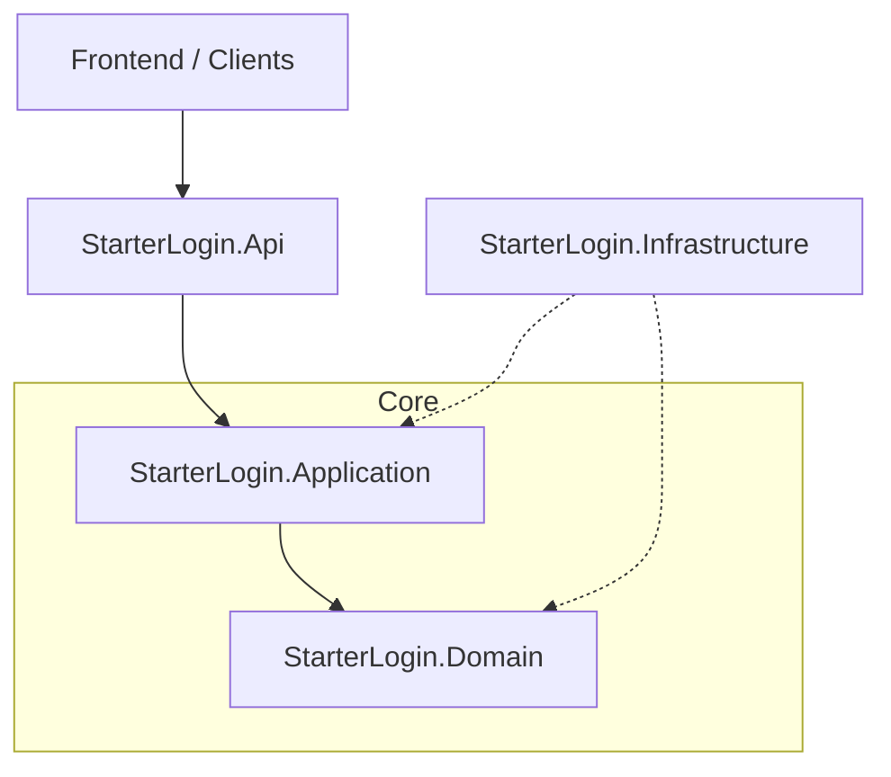

# StarterLogin - Sistema de Autenticación Empresarial

Este proyecto es una solución robusta de autenticación construida con tecnologías de vanguardia, diseñada bajo principios de **Clean Architecture** y modularidad. Proporciona una base sólida para la gestión de usuarios, seguridad JWT y una interfaz de usuario moderna.

## 🚀 Tecnologías Core

- **Backend**: .NET 9.0 (C#)
- **Base de Datos**: PostgreSQL
- **Arquitectura**: Clean Architecture
- **Patrón de Mensajería**: MediatR (CQRS Lite)
- **Frontend**: Vue 3 + Vite + TypeScript
- **Gestión de Estado**: Pinia
- **Contenedores**: Docker & Docker Compose

---

## 📊 Arquitectura y Flujo (UML)

### Diagrama de Secuencia (Login)
Este diagrama describe la interacción entre componentes durante el proceso de autenticación.



### Arquitectura de Capas (Clean Architecture)


---

## 🗺️ Mapa del Proyecto

### 🟡 Resumen Técnico (Docker)
| Servicio | URL Local | Puerto Host | Notas |
| :--- | :--- | :--- | :--- |
| **Frontend** | `http://localhost:5900` | 5900 | Interfaz de usuario (Vue 3) |
| **Backend API** | `http://localhost:5901` | 5901 | Endpoint base: `/api` |
| **Base de Datos** | `localhost:5902` | 5902 | PostgreSQL (admin/admin) |

---

### 🟢 Backend (Ver [Guía Detallada](./LogiBackend/README.md))

| Capa | Responsabilidad |
| :--- | :--- |
| **StarterLogin.Domain** | Entidades de negocio y lógica pura. |
| **StarterLogin.Application** | Orquestación y casos de uso (MediatR). |
| **StarterLogin.Infrastructure** | Datos (EF Core), Seguridad y JWT. |
| **StarterLogin.Api** | Controladores y Endpoints REST. |

### 🔵 Frontend (Ver [Guía Detallada](./LogiFrontend/README.md))

| Directorio | Responsabilidad |
| :--- | :--- |
| **`api/`** | Servicios de comunicación HTTP (Axios) configurados para interactuar con el backend. |
| **`stores/`** | Gestión del estado global (Autenticación, Notificaciones) mediante Pinia. |
| **`views/`** | Páginas principales de la aplicación (Login, Dashboard, Perfil). |
| **`components/`** | Elementos de UI reutilizables como la barra de navegación y contenedores de mensajes. |

---

## 🔄 Ciclo de Vida de una Petición (Ejemplo: Login)

Para entender cómo fluye la información a través del sistema, aquí se detalla el ciclo de vida de una solicitud de inicio de sesión:

1.  **Frontend (UI)**: El usuario introduce sus credenciales en `Login.vue`. Al hacer clic en "Entrar", se invoca la acción `login` en el `authStore`.
2.  **Frontend (API)**: El `authStore` envía una petición POST a `/api/auth/login` mediante Axios.
3.  **Backend (API)**: El `AuthController` recibe la solicitud y delega la ejecución al `Mediator` enviando un `LoginUserQuery`.
4.  **Backend (Application)**: El `LoginUserQueryHandler` toma el control.
    - Consulta al repositorio (`Infrastructure`) para encontrar al usuario en PostgreSQL.
    - Valida la contraseña usando el servicio de hashing.
    - Si es válido, solicita al generador de tokens un JWT firmado.
5.  **Backend (Infrastructure)**: El repositorio realiza la consulta SQL optimizada a la base de datos PostgreSQL.
6.  **Respuesta**: El `Handler` devuelve la información del usuario y el token al controlador, que responde con un `200 OK`.
7.  **Sincronización**: El Store de Vue guarda el token y redirige al usuario al **Dashboard**.

---

## 🛠️ Configuración y Ejecución

### Requisitos
- .NET 9.0 SDK
- PostgreSQL
- Node.js (v18+)

### Ejecución con Docker (Recomendado)
```bash
docker-compose up --build
```

### Ejecución Manual
1.  **Base de Datos**: Asegúrate de tener PostgreSQL corriendo (en el puerto **5902** si usas Docker) y actualiza el `appsettings.json`.
2.  **Migraciones**: Al cambiar de SQL Server a PostgreSQL, es necesario regenerar las migraciones:
    ```bash
    cd LogiBackend/src/StarterLogin.Infrastructure
    dotnet ef migrations add InitialPostgres --startup-project ../StarterLogin.Api
    dotnet ef database update --startup-project ../StarterLogin.Api
    ```
3.  **Backend**:
    ```bash
    cd LogiBackend/src/StarterLogin.Api
    dotnet run
    ```
4.  **Frontend**:
    ```bash
    cd LogiFrontend
    npm install
    npm run dev
    ```

---

## 📄 Licencia
Este proyecto está bajo la licencia MIT.
