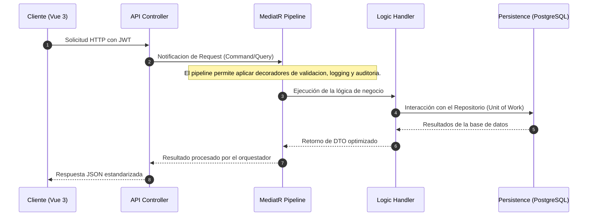
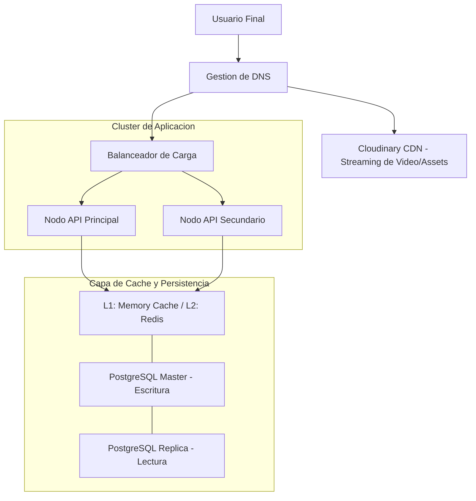
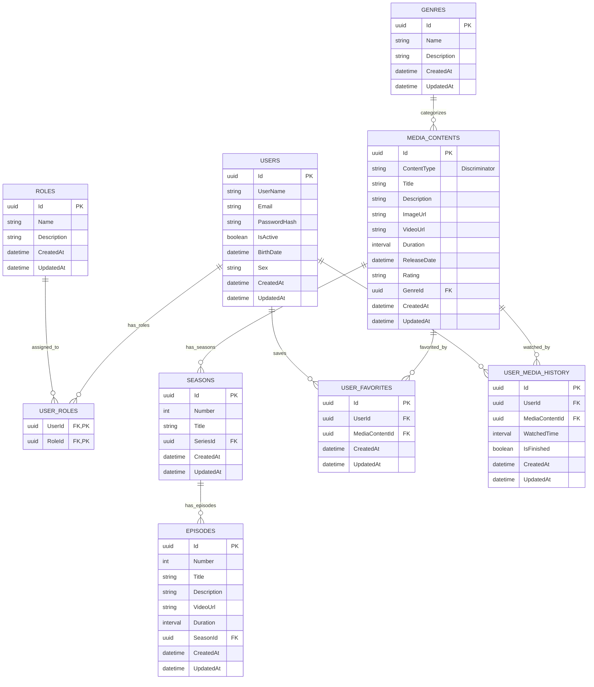
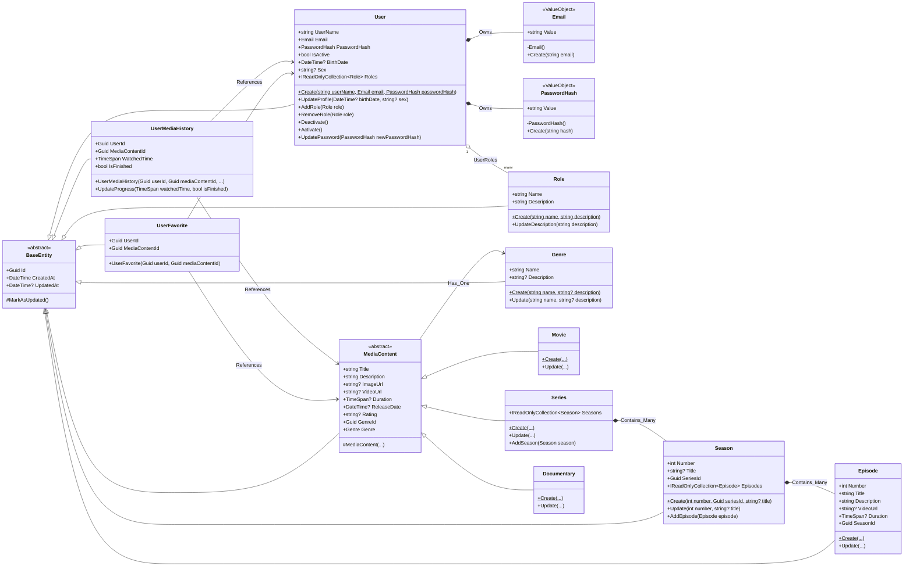

# StarterLogin: Enterprise Media Streaming Platform

[](https://dotnet.microsoft.com/)
[](https://vuejs.org/)
[](https://www.postgresql.org/)
[](#)

StarterLogin es una plataforma de streaming multimedia de alto rendimiento diseñada bajo los estándares de arquitectura limpia (Clean Architecture), diseño guiado por el dominio (Domain-Driven Design) y segregación de responsabilidad en consultas y comandos (CQRS) mediante la librería MediatR. Esta solución proporciona una base robusta y altamente escalable para gestionar volúmenes masivos de usuarios y contenido multimedia de manera eficiente y segura.

---

## Especificaciones Tecnicas y Arquitectura

La plataforma utiliza un stack tecnológico de vanguardia para garantizar el máximo rendimiento y la estabilidad a largo plazo.

| Capa | Tecnologias | Proposito y Justificacion |
| :--- | :--- | :--- |
| **API Layer** | .NET 9.0 Web API | Implementación de controladores delgados que delegan la lógica de negocio a la capa de aplicación. |
| **Orquestacion** | MediatR (CQRS) | Implementación de comandos y consultas desacoplados, facilitando el mantenimiento y el escalado independiente de las operaciones de lectura y escritura. |
| **Persistencia** | PostgreSQL (EF Core) | Uso de un motor relacional de grado empresarial con soporte avanzado para consultas complejas e indexación eficiente. |
| **Capa de Dominio** | Logic Pura (POCO) | Entidades y lógica de negocio totalmente desacopladas de cualquier infraestructura o framework externo. |
| **Capa de Aplicacion** | Handlers de MediatR | Orquestación de casos de uso y transformación de datos entre entidades de dominio y DTOs de respuesta. |
| **Frontend Core** | Vue 3 + Vite | Framework reactivo de última generación que garantiza una experiencia de usuario fluida y tiempos de carga mínimos. |
| **Gestion de Estado** | Pinia | Implementación de almacenes (stores) globales para gestionar la autenticación y el flujo de datos de forma centralizada. |

---

## Arquitectura del Sistema y Flujo de Datos

### Ciclo de Vida de una Peticion

La arquitectura está diseñada para que cada solicitud pase por un proceso estandarizado que garantiza la integridad y el rendimiento antes de interactuar con la persistencia.



### Infraestructura de Red y Escalabilidad Fisica

El sistema contempla una distribución que permite el escalado horizontal y la descarga de tráfico pesado a servicios especializados.



### Modelo de Datos (Relacional)



### Jerarquia de Dominio (Diagrama de Clases)



---

## Estructura de Directorios y Responsabilidades

Una separación clara de las capas asegura que cada componente tenga una única responsabilidad bien definida.

### Backend (LogiBackend)

*   **StarterLogin.Domain**: Contiene las definiciones de entidades, interfaces de repositorio y lógica de negocio pura. Es la capa de mayor nivel y no debe tener dependencias de otras capas.
*   **StarterLogin.Application**: Define los flujos de trabajo de la aplicación, DTOs, comandos, consultas y sus respectivos manejadores. Es donde se implementa la lógica de orquestación de MediatR.
*   **StarterLogin.Infrastructure**: Implementa las interfaces definidas en el dominio. Aquí se encuentran las configuraciones de Entity Framework, la implementación de repositorios, los servicios de seguridad (JWT) y la integración con proveedores externos como Cloudinary.
*   **StarterLogin.Api**: Contiene los puntos de entrada HTTP, la configuración de la inyección de dependencias general y la definición del pipeline de ejecución de ASP.NET Core.

### Frontend (LogiFrontend)

*   **src/api**: Centraliza la configuración de Axios, incluyendo interceptores para la gestión automática de tokens de autenticación en las cabeceras.
*   **src/services**: Proporciona una capa de abstracción para las llamadas a la API, agrupadas por dominios funcionales (autenticación, multimedia).
*   **src/stores**: Gestiona el estado reactivo global de la aplicación utilizando Pinia.
*   **src/views**: Agrupa los componentes de nivel de página que se asocian a las rutas del sistema.
*   **src/components**: Contiene elementos de interfaz de usuario reutilizables siguiendo un enfoque de diseño modular.

---

## Configuracion del Sistema

La correcta configuración de las variables de entorno y los archivos de parámetros es fundamental para el funcionamiento del ecosistema. A continuación se detallan las configuraciones requeridas para ambos componentes.

### Configuracion del Backend (appsettings.json)

El archivo `appsettings.json` en `LogiBackend/src/StarterLogin.Api` gestiona la conectividad y la seguridad del servidor.

| Seccion | Variable | Descripcion | Ejemplo / Valor Recomendado |
| :--- | :--- | :--- | :--- |
| **ConnectionStrings** | `DefaultConnection` | Cadena de conexión para PostgreSQL. | `Host=localhost;Port=5902;Database=StarterLoginDb;Username=postgres;Password=admin` |
| **JwtSettings** | `Secret` | Clave de firma para los tokens JWT. Debe ser una cadena larga y aleatoria. | `TU_CLAVE_SECRETA_DE_AL_MENOS_32_CARACTERES` |
| **JwtSettings** | `Issuer` | El emisor del token (usualmente el nombre de la API). | `StarterLoginApi` |
| **JwtSettings** | `Audience` | El receptor del token (usualmente el nombre del frontend). | `StarterLoginFront` |
| **JwtSettings** | `ExpirationInMinutes` | Tiempo de vida del Access Token. | `1440` (24 horas) |
| **CloudinarySettings** | `CloudName` | Nombre de la nube en el dashboard de Cloudinary. | `nombre_de_tu_nube` |
| **CloudinarySettings** | `ApiKey` | Clave de API proporcionada por Cloudinary. | `tu_api_key_publica` |
| **CloudinarySettings** | `ApiSecret` | Secreto de API para operaciones firmadas. | `tu_api_secret_privado` |

### Configuracion del Frontend (.env)

El frontend utiliza variables de entorno cargadas por Vite. Cree un archivo `.env` en la raíz de `LogiFrontend` basado en el siguiente esquema:

| Variable | Descripcion | Valor por Defecto / Local |
| :--- | :--- | :--- |
| `VITE_API_URL` | URL base de los endpoints de la API backend. | `http://localhost:5901/api` |
| `VITE_APP_TITLE` | Título de la aplicación que se muestra en el navegador. | `StarterLogin` |

> [!NOTE]
> En entornos Docker, estas variables se inyectan automáticamente a través del archivo `docker-compose.yml`. Si realiza cambios manuales en el entorno local, asegúrese de reiniciar los servicios para que los cambios surtan efecto.

---

## Guia de Instalacion y Despliegue

### Despliegue con Docker

El uso de Docker garantiza la consistencia entre los entornos de desarrollo, pruebas y producción.

1.  Asegúrese de tener instalado Docker Desktop en su sistema.
2.  Desde la raíz del proyecto, ejecute el siguiente comando:
    ```bash
    docker-compose up --build
    ```
3.  Una vez finalizado, los servicios estarán disponibles en:
    - Frontend: http://localhost:5900
    - Backend Swagger: http://localhost:5901/swagger

### Despliegue en Entorno de Desarrollo Local

Si prefiere ejecutar los servicios de forma nativa para un desarrollo más dinámico:

1.  **Requisitos**: Instale el SDK de .NET 9.0, Node.js v18+ y una instancia de PostgreSQL accesible.
2.  **Configuracion de Base de Datos**: Actualice la cadena de conexión en el archivo `appsettings.json` o utilice las variables de entorno correspondientes.
3.  **Ejecucion del Backend**:
    ```bash
    cd LogiBackend/src/StarterLogin.Api
    dotnet run
    ```
4.  **Ejecucion del Frontend**:
    ```bash
    cd LogiFrontend
    npm install
    npm run dev
    ```

---

## Estrategias de Desarrollo y Mejores Practicas

### Implementacion de Nuevas Funcionalidades

Para mantener la integridad arquitectónica, siga estos pasos al extender el sistema:

1.  **Definicion en el Dominio**: Si la funcionalidad requiere nuevas entidades o cambios en las existentes, empiece por la capa de Dominio.
2.  **Definicion de Contratos**: Crea las interfaces necesarias en el Dominio para que la Infraestructura las implemente después.
3.  **Casos de Uso**: Crea los Comandos o Consultas en la capa de Aplicación junto con sus manejadores.
4.  **Exposicion de API**: Añada o actualice los controladores en la capa Api para permitir el acceso a través de MediatR.
5.  **Integracion Frontend**: Implemente el servicio correspondiente en Vue y actualice los almacenes de Pinia según sea necesario.

### Recomendaciones Expertas de Rendimiento y Seguridad

> [!IMPORTANT]
> **Gestion de Caché**: Utilice estrategias de caché SlidingExpiration para datos de alta frecuencia de consulta pero baja volatilidad. Esto reduce drásticamente la carga sobre la base de datos y mejora los tiempos de respuesta.

> [!IMPORTANT]
> **Validacion en Pipeline**: Implemente validaciones automáticas utilizando FluentValidation dentro del pipeline de MediatR. Esto asegura que ningún comando con datos inválidos llegue siquiera a la capa de infraestructura.

> [!IMPORTANT]
> **Seguridad JWT**: No almacene información sensible en los claims del token. El backend debe validar siempre la identidad del usuario contra la base de datos o el sistema de caché para operaciones críticas.

---

## Solucion de Problemas y Diagnostico

*   **Conflictos de Puerto**: Si los puertos 5900 o 5901 están ocupados, modifique el archivo `docker-compose.yml` y ajuste la configuración de CORS en el backend y la variable de entorno de la API en el frontend.
*   **Errores de Migracion**: En caso de errores al iniciar la base de datos, limpie los volúmenes de Docker mediante `docker-compose down -v` para forzar un re-seed de los datos iniciales.
*   **Conexion de Red en Docker**: Recuerde que dentro de los contenedores, la instancia de base de datos se identifica por el nombre del servicio definido en el archivo compose, no por "localhost".

---

## Licencia

Este proyecto se distribuye bajo la licencia MIT.
