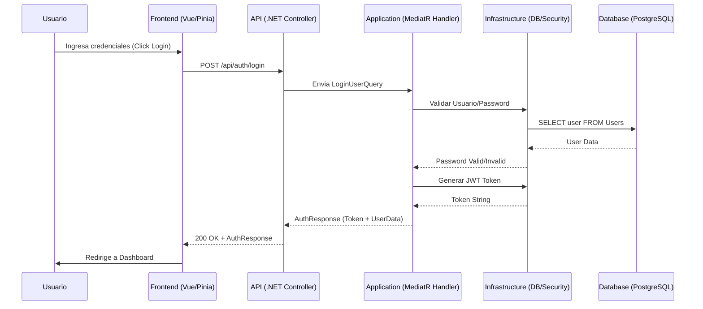
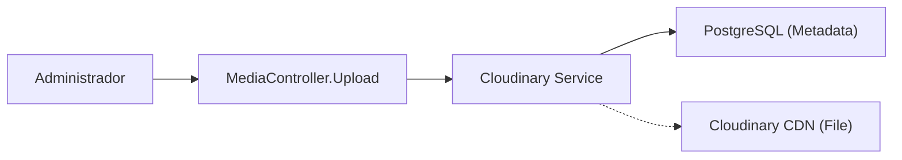
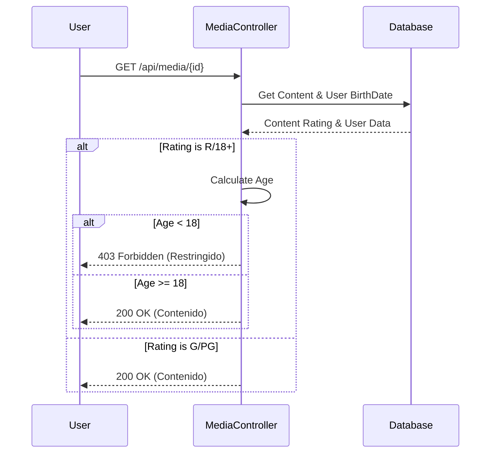
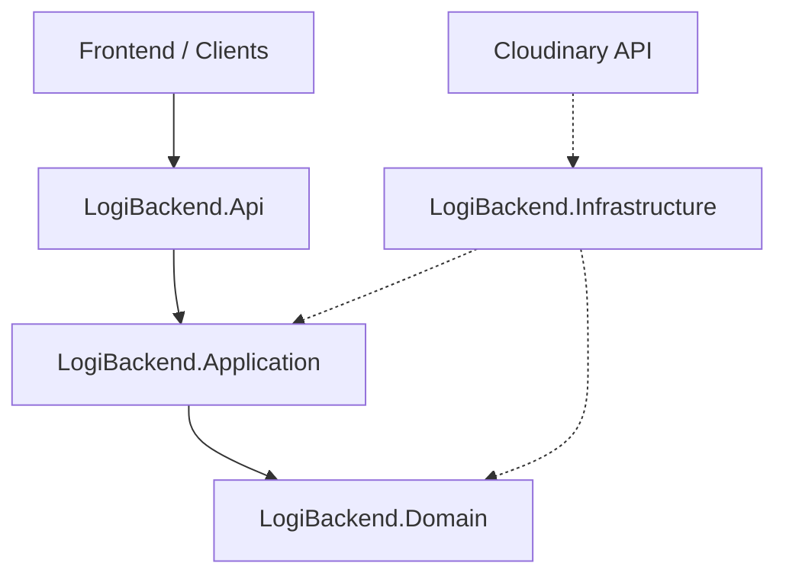
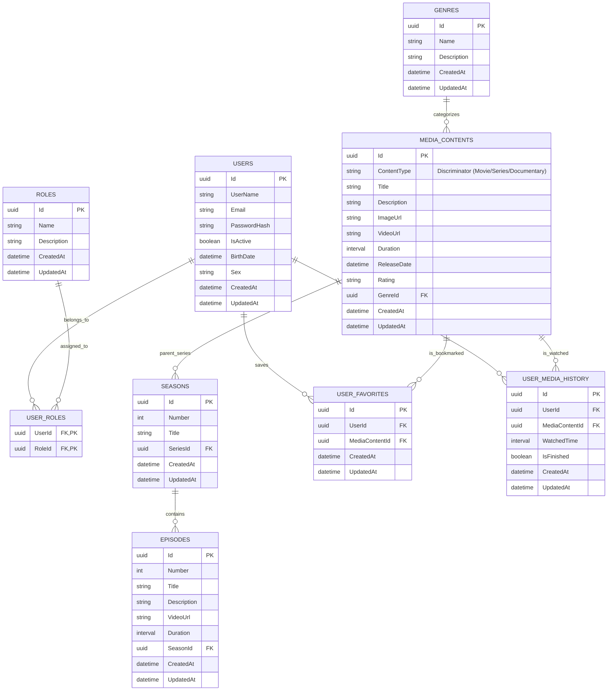
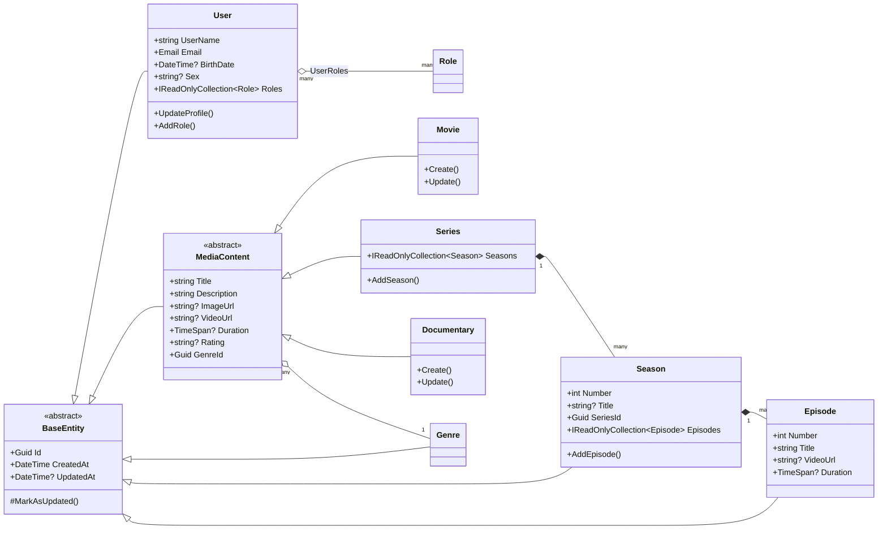

# StarterLogin - Sistema de Autenticación Empresarial

Este proyecto es una solución robusta de autenticación construida con tecnologías de vanguardia, diseñada bajo principios de **Clean Architecture** y modularidad. Proporciona una base sólida para la gestión de usuarios, seguridad JWT y una interfaz de usuario moderna.

## 🚀 Tecnologías Core

- **Backend**: .NET 9.0 (C#)
- **Base de Datos**: PostgreSQL
- **Arquitectura**: Clean Architecture
- **Patrón de Mensajería**: MediatR (CQRS Lite)
- **Frontend**: Vue 3 + Vite + TypeScript
- **Gestión de Estado**: Pinia
- **Almacenamiento**: Cloudinary (Im√°genes y Videos)
- **Caché**: MemoryCache (L1)

---

## üìä Arquitectura y Flujo (UML)

### Diagrama de Secuencia (Login)
Este diagrama describe la interacción entre componentes durante el proceso de autenticación.


```mermaid
sequenceDiagram
    participant U as Usuario
    participant F as Frontend (Vue/Pinia)
    participant A as API (.NET Controller)
    participant B as Application (MediatR Handler)
    participant I as Infrastructure (DB/Security)
    participant D as Database (PostgreSQL)

    U->>F: Ingresa credenciales (Click Login)
    F->>A: POST /api/auth/login
    A->>B: Envia LoginUserQuery
    B->>I: Validar Usuario/Password
    I->>D: SELECT user FROM Users
    D-->>I: User Data
    I-->>B: Password Valid/Invalid
    B->>I: Generar JWT Token
    I-->>B: Token String
    B-->>A: AuthResponse (Token + UserData)
    A-->>F: 200 OK + AuthResponse
    F->>U: Redirige a Dashboard
```

### Proceso de Carga Multimedia (Cloudinary)

```mermaid
graph LR
    Admin[Administrador] --> API[MediaController.Upload]
    API --> Cloud["Cloudinary Service"]
    Cloud --> DB["PostgreSQL (Metadata)"]
    Cloud -.-> CDN["Cloudinary CDN (File)"]
```

### Control de Acceso por Edad (Parental Control)

```mermaid
sequenceDiagram
    participant User
    participant API as MediaController
    participant DB as Database

    User->>API: GET /api/media/{id}
    API->>DB: Get Content & User BirthDate
    DB-->>API: Content Rating & User Data
    alt Rating is R/18+
        API->>API: Calculate Age
        alt Age < 18
            API-->>User: 403 Forbidden (Restringido)
        else Age >= 18
            API-->>User: 200 OK (Contenido)
        end
    else Rating is G/PG
        API-->>User: 200 OK (Contenido)
    end
```

### Arquitectura de Capas (Multimedia Extension)

```mermaid
graph TD
    UI[Frontend / Clients] --> API[LogiBackend.Api]
    API --> APP[LogiBackend.Application]
    APP --> DOM[LogiBackend.Domain]
    INF[LogiBackend.Infrastructure] -.-> APP
    INF -.-> DOM
    CLOUD[Cloudinary API] -.-> INF
```

### Diagrama de Entidad-Relación (ER)
Este diagrama describe la estructura de la base de datos PostgreSQL, incluyendo la estrategia de **Table Per Hierarchy (TPH)** para el contenido multimedia y las relaciones de muchos a muchos.


```mermaid
erDiagram
    %% USER MANAGEMENT
    USERS ||--o{ USER_ROLES : "belongs_to"
    ROLES ||--o{ USER_ROLES : "assigned_to"

    %% TPH HIERARCHY (Single Table in DB)
    MEDIA_CONTENTS {
        uuid Id PK
        string ContentType "Discriminator (Movie/Series/Documentary)"
        string Title
        string Description
        string ImageUrl
        string VideoUrl
        interval Duration
        datetime ReleaseDate
        string Rating
        uuid GenreId FK
        datetime CreatedAt
        datetime UpdatedAt
    }

    %% RELATIONSHIPS
    GENRES ||--o{ MEDIA_CONTENTS : "categorizes"
    
    MEDIA_CONTENTS ||--o{ SEASONS : "parent_series"
    SEASONS ||--o{ EPISODES : "contains"
    
    USERS ||--o{ USER_FAVORITES : "saves"
    MEDIA_CONTENTS ||--o{ USER_FAVORITES : "is_bookmarked"
    
    USERS ||--o{ USER_MEDIA_HISTORY : "watches"
    MEDIA_CONTENTS ||--o{ USER_MEDIA_HISTORY : "is_watched"

    %% ENTITY DEFINITIONS
    USERS {
        uuid Id PK
        string UserName
        string Email
        string PasswordHash
        boolean IsActive
        datetime BirthDate
        string Sex
        datetime CreatedAt
        datetime UpdatedAt
    }

    ROLES {
        uuid Id PK
        string Name
        string Description
        datetime CreatedAt
        datetime UpdatedAt
    }

    %% PIVOT TABLE (Explicitly defined)
    USER_ROLES {
        uuid UserId FK, PK
        uuid RoleId FK, PK
    }

    GENRES {
        uuid Id PK
        string Name
        string Description
        datetime CreatedAt
        datetime UpdatedAt
    }

    SEASONS {
        uuid Id PK
        int Number
        string Title
        uuid SeriesId FK
        datetime CreatedAt
        datetime UpdatedAt
    }

    EPISODES {
        uuid Id PK
        int Number
        string Title
        string Description
        string VideoUrl
        interval Duration
        uuid SeasonId FK
        datetime CreatedAt
        datetime UpdatedAt
    }

    USER_FAVORITES {
        uuid Id PK
        uuid UserId FK
        uuid MediaContentId FK
        datetime CreatedAt
        datetime UpdatedAt
    }

    USER_MEDIA_HISTORY {
        uuid Id PK
        uuid UserId FK
        uuid MediaContentId FK
        interval WatchedTime
        boolean IsFinished
        datetime CreatedAt
        datetime UpdatedAt
    }
```

### Clase de Dominio e Herencia (DDD)
Diagrama detallado de la jerarquía de objetos de dominio. Se han incluido todas las propiedades para evitar cajas vacías y asegurar la comprensión total del modelo.


```mermaid
classDiagram
    direction LR
    class BaseEntity {
        <<abstract>>
        +Guid Id
        +DateTime CreatedAt
        +DateTime? UpdatedAt
        #MarkAsUpdated()
    }
    
    class User {
        +string UserName
        +Email Email
        +DateTime? BirthDate
        +string? Sex
        +IReadOnlyCollection~Role~ Roles
        +UpdateProfile()
        +AddRole()
    }
    
    class MediaContent {
        <<abstract>>
        +string Title
        +string Description
        +string? ImageUrl
        +string? VideoUrl
        +TimeSpan? Duration
        +string? Rating
        +Guid GenreId
    }
    
    class Movie {
        +Create()
        +Update()
    }
    
    class Series {
        +IReadOnlyCollection~Season~ Seasons
        +AddSeason()
    }
    
    class Documentary {
        +Create()
        +Update()
    }
    
    class Season {
        +int Number
        +string? Title
        +Guid SeriesId
        +IReadOnlyCollection~Episode~ Episodes
        +AddEpisode()
    }
    
    class Episode {
        +int Number
        +string Title
        +string? VideoUrl
        +TimeSpan? Duration
    }

    BaseEntity <|-- User
    BaseEntity <|-- MediaContent
    BaseEntity <|-- Genre
    BaseEntity <|-- Season
    BaseEntity <|-- Episode
    
    MediaContent <|-- Movie
    MediaContent <|-- Series
    MediaContent <|-- Documentary

    User "many" o-- "many" Role : UserRoles
    MediaContent "many" o-- "1" Genre
    Series "1" *-- "many" Season
    Season "1" *-- "many" Episode
```

---

## 📽️ Nuevas Funcionalidades Multimedia
- **Tipos de Contenido**: Soporte para Películas, Series y Documentales con herencia optimizada (TPH).
- **Categorización**: Sistema de géneros dinámicos.
- **Experiencia de Usuario**: Historial de reproducción (continuar viendo) y lista de favoritos.
- **Búsqueda Proactiva**: Búsqueda por título y género con recomendaciones inteligentes.
- **Seguridad**: Validación de edad automática para contenido restringido.

---

## 🗺️ Mapa del Proyecto

### 🟡 Resumen Técnico (Docker)
| Servicio | URL Local | Puerto Host | Notas |
| :--- | :--- | :--- | :--- |
| **Frontend** | `http://localhost:5900` | 5900 | Interfaz de usuario (Vue 3) |
| **Backend API** | `http://localhost:5901` | 5901 | Endpoint base: `/api` |
| **API Docs (Swagger)** | `http://localhost:5901/swagger` | 5901 | Documentación Interactiva |
| **Base de Datos** | `localhost:5902` | 5902 | PostgreSQL (admin/admin) |

---

### 🟢 Backend (Ver [Guía Detallada](./LogiBackend/README.md))

| Capa | Responsabilidad |
| :--- | :--- |
| **StarterLogin.Domain** | Entidades de negocio y lógica pura. |
| **StarterLogin.Application** | Orquestación y casos de uso (MediatR). |
| **StarterLogin.Infrastructure** | Datos (EF Core), Seguridad y JWT. |
| **StarterLogin.Api** | Controladores y Endpoints REST. |

### 🔵 Frontend (Ver [Guía Detallada](./LogiFrontend/README.md))

| Directorio | Responsabilidad |
| :--- | :--- |
| **`api/`** | Servicios de comunicación HTTP (Axios) configurados para interactuar con el backend. |
| **`stores/`** | Gestión del estado global (Autenticación, Notificaciones) mediante Pinia. |
| **`views/`** | Páginas principales de la aplicación (Login, Dashboard, Perfil). |
| **`components/`** | Elementos de UI reutilizables como la barra de navegación y contenedores de mensajes. |

---

## 🔄 Ciclo de Vida de una Petición (Ejemplo: Login)

Para entender cómo fluye la información a través del sistema, aquí se detalla el ciclo de vida de una solicitud de inicio de sesión:

1.  **Frontend (UI)**: El usuario introduce sus credenciales en `Login.vue`. Al hacer clic en "Entrar", se invoca la acción `login` en el `authStore`.
2.  **Frontend (API)**: El `authStore` envía una petición POST a `/api/auth/login` mediante Axios.
3.  **Backend (API)**: El `AuthController` recibe la solicitud y delega la ejecución al `Mediator` enviando un `LoginUserQuery`.
4.  **Backend (Application)**: El `LoginUserQueryHandler` toma el control.
    - Consulta al repositorio (`Infrastructure`) para encontrar al usuario en PostgreSQL.
    - Valida la contraseña usando el servicio de hashing.
    - Si es v√°lido, solicita al generador de tokens un JWT firmado.
5.  **Backend (Infrastructure)**: El repositorio realiza la consulta SQL optimizada a la base de datos PostgreSQL.
6.  **Respuesta**: El `Handler` devuelve la información del usuario y el token al controlador, que responde con un `200 OK`.
7.  **Sincronización**: El Store de Vue guarda el token y redirige al usuario al **Dashboard**.

---

## 🛠️ Configuración y Ejecución

### Requisitos
- .NET 9.0 SDK
- PostgreSQL
- Node.js (v18+)

### Ejecución con Docker (Recomendado)
```bash
docker-compose up --build
```

### Ejecución Manual
1.  **Base de Datos**: Aseg√∫rate de tener PostgreSQL corriendo (en el puerto **5902** si usas Docker) y actualiza el `appsettings.json`.
2.  **Migraciones**: Al cambiar de SQL Server a PostgreSQL, es necesario regenerar las migraciones:
    ```bash
    cd LogiBackend/src/StarterLogin.Infrastructure
    dotnet ef migrations add InitialPostgres --startup-project ../StarterLogin.Api
    dotnet ef database update --startup-project ../StarterLogin.Api
    ```
3.  **Backend**:
    ```bash
    cd LogiBackend/src/StarterLogin.Api
    dotnet run
    ```
4.  **Frontend**:
    ```bash
    cd LogiFrontend
    npm install
    npm run dev
    ```

---

## 🛠️ Comandos Útiles (Useful Commands)

### üê≥ Docker & Despliegue
- `docker-compose up --build`: Construye y levanta todo el sistema.
- `docker-compose down -v`: Borra todo y **limpia la base de datos**. √ötil para resetear seeds.
- `docker logs -f starterlogin-backend-1`: Ver logs del servidor en tiempo real.

### 🛡️ Backend (.NET)
- `dotnet watch --project LogiBackend/src/StarterLogin.Api`: Inicia con auto-recarga.
- `dotnet ef migrations add <Nombre> --project LogiBackend/src/StarterLogin.Infrastructure --startup-project LogiBackend/src/StarterLogin.Api`: Crea una migración.
- `dotnet ef database update --project LogiBackend/src/StarterLogin.Infrastructure --startup-project LogiBackend/src/StarterLogin.Api`: Aplica cambios a la DB.

### üé® Frontend (Vue)
- `npm run dev`: Servidor de desarrollo r√°pido con HMR.
- `npm run build`: Genera archivos optimizados para producción.

---

## üí° Consejos Pro

- **Limpieza de Caché**: Si Docker se comporta extraño, usa `docker system prune` (Cuidado: borra todo lo que no uses).
- **Puertos**: Si cambias los puertos en `docker-compose.yml`, recuerda actualizar el `baseURL` en `LogiFrontend/src/api/axios.ts`.
- **Transparencia**: Usa la interfaz de **Swagger** (`/swagger`) para probar los endpoints sin necesidad de usar el frontend.

---

## 📄 Licencia
Este proyecto est√° bajo la licencia MIT.
